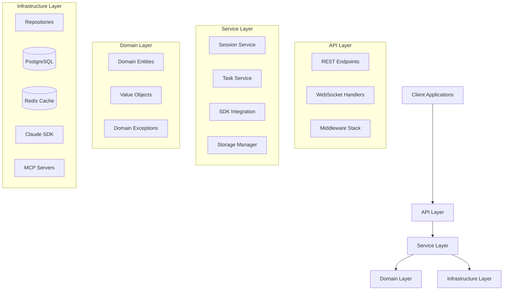
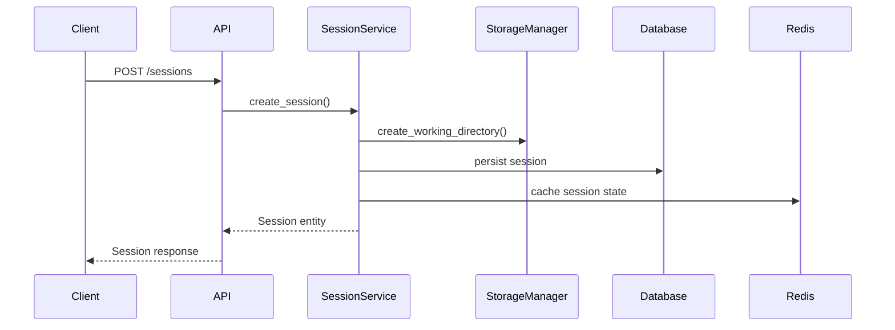
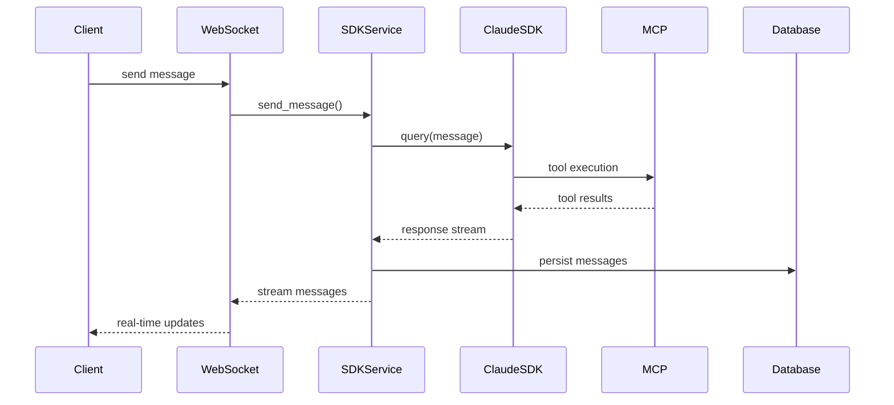
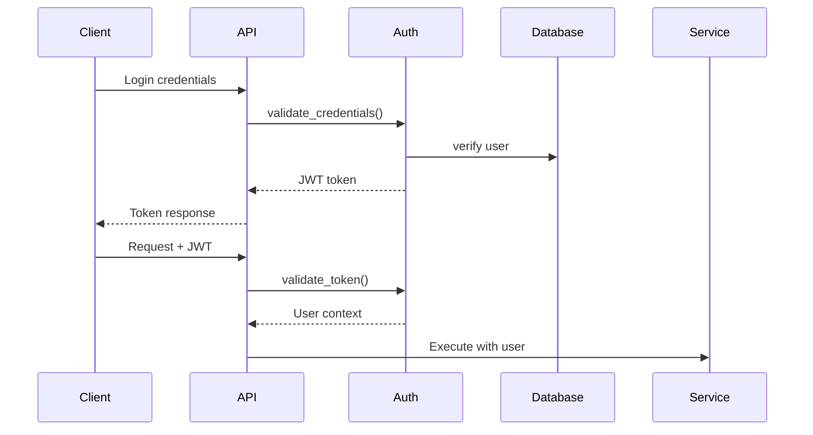

# Technical Architecture

The AI-Agent-API service implements **Clean Architecture** principles with clear separation of concerns across API, Service, Domain, and Infrastructure layers.

## Architecture Overview



## Layer Responsibilities

### API Layer (`app/api/`)

**Purpose**: Handle HTTP/WebSocket requests and responses

**Components**:
- **REST Endpoints**: FastAPI routers for CRUD operations
- **WebSocket Handlers**: Real-time bidirectional communication
- **Middleware Stack**: Request processing pipeline
- **Dependencies**: Dependency injection for authentication and database

**Key Files**:
- `app/api/endpoints/sessions.py` - Session management endpoints
- `app/api/endpoints/tasks.py` - Task automation endpoints  
- `app/api/endpoints/websocket.py` - WebSocket streaming
- `app/api/middleware.py` - Custom middleware (logging, rate limiting, CORS)
- `app/api/dependencies.py` - FastAPI dependency providers

### Service Layer (`app/services/`)

**Purpose**: Orchestrate business workflows and external integrations

**Components**:
- **SessionService**: Core session lifecycle management
- **SDKIntegratedSessionService**: Claude SDK integration with MCP
- **TaskService**: Task execution and scheduling logic
- **StorageManager**: File system and report management

**Key Classes**:
- `SessionService` - CRUD operations and session state management
- `SDKIntegratedSessionService` - Extends SessionService with Claude SDK
- `TaskService` - Task template rendering and execution orchestration
- `StorageManager` - Working directory and report file management

### Domain Layer (`app/domain/`)

**Purpose**: Encapsulate business rules and domain logic

**Components**:
- **Entities**: Aggregate roots with business behavior
- **Value Objects**: Immutable data structures  
- **Exceptions**: Domain-specific error types

**Key Entities**:
- `User` - User aggregate with roles, quotas, and permissions
- `Session` - Session aggregate with state transitions and metrics
- `Task` - Task aggregate with template rendering and validation
- `Organization` - Multi-tenant organization boundary

### Infrastructure Layer (`app/repositories/`, `app/claude_sdk/`)

**Purpose**: Handle external system integrations and data persistence

**Components**:
- **Repositories**: Database access layer with SQLAlchemy
- **Claude SDK**: Official SDK integration with hooks and callbacks
- **MCP Framework**: Model Context Protocol server management
- **Database Models**: SQLAlchemy ORM models

## Data Flow Architecture

### Session Creation Flow



### Message Processing Flow



## Component Integration

### Dependency Injection

The service uses FastAPI's dependency injection system for clean component wiring:

```python
# Example: Session endpoint with injected dependencies
@router.post("/sessions")
async def create_session(
    request: SessionCreateRequest,
    current_user: User = Depends(get_current_user),
    session_service: SessionService = Depends(get_session_service),
    db: AsyncSession = Depends(get_database),
):
    return await session_service.create_session(...)
```

### Service Composition

Services are composed through constructor injection:

```python
# SDKIntegratedSessionService extends SessionService
class SDKIntegratedSessionService(SessionService):
    def __init__(
        self,
        # Parent dependencies
        db: AsyncSession,
        session_repo: SessionRepository,
        # Additional SDK dependencies  
        sdk_client_manager: ClaudeSDKClientManager,
        permission_service: PermissionService,
    ):
        super().__init__(db, session_repo, ...)
        self.sdk_client_manager = sdk_client_manager
```

## Configuration Management

### Settings Architecture

Centralized configuration using Pydantic settings:

```python
class Settings(BaseSettings):
    # Database
    database_url: str
    redis_url: str
    
    # Claude SDK
    anthropic_api_key: str
    claude_model: str = "claude-3-5-sonnet-20241022"
    
    # MCP Servers
    mcp_servers: Dict[str, MCPServerConfig] = {}
    
    # Security
    secret_key: str
    jwt_algorithm: str = "HS256"
    
    class Config:
        env_file = ".env"
```

### Environment-based Configuration

Different configurations for development, staging, and production environments:

- **Development**: Debug logging, local database, reduced quotas
- **Staging**: Production-like setup with test data
- **Production**: Optimized settings, external monitoring, high quotas

## Security Architecture

### Authentication Flow



### Authorization Model

**Role-Based Access Control (RBAC)**:
- **Admin**: Full system access, user management
- **User**: Own sessions/tasks, quota-limited operations  
- **Viewer**: Read-only access to permitted resources

**Resource-Level Permissions**:
- Session access: Owner or admin
- Task execution: Owner with quota validation
- MCP tool usage: Permission callback system

### Security Layers

1. **Transport Security**: HTTPS/WSS for all communications
2. **Authentication**: JWT tokens with configurable expiration
3. **Authorization**: RBAC with resource-level permissions
4. **Input Validation**: Pydantic schemas for all API inputs
5. **Rate Limiting**: Per-user API and token usage quotas
6. **Audit Logging**: Comprehensive security event tracking

## Scalability Patterns

### Horizontal Scaling

**Stateless Design**: All session state persisted in database/Redis
**Load Balancing**: Multiple API instances behind load balancer
**WebSocket Scaling**: Redis-based session sharing across instances

### Database Scaling

**Connection Pooling**: SQLAlchemy async engine with configurable pools
**Read Replicas**: Separate read-only database connections (future)
**Query Optimization**: Proper indexing and query patterns

### Caching Strategy

**Redis Layers**:
- Session state caching
- User authentication cache  
- Rate limiting counters
- WebSocket session registry

## Monitoring & Observability

### Metrics Collection

**Application Metrics**:
- Session creation/completion rates
- API response times and error rates
- Claude SDK usage and costs
- WebSocket connection counts

**System Metrics**:
- Database connection pool usage
- Redis memory usage
- File system storage usage
- CPU and memory utilization

### Logging Strategy

**Structured Logging**:
- JSON format with consistent fields
- Request ID tracking across components
- User ID and session ID correlation
- Error stack traces with context

### Health Checks

**Readiness Probes**:
- Database connectivity
- Redis availability  
- Claude API accessibility

**Liveness Probes**:
- Application responsiveness
- Memory usage within limits
- No deadlocked threads

## Error Handling Strategy

### Exception Hierarchy

```python
DomainException
├── ValidationError
├── SessionNotFoundError  
├── PermissionDeniedError
├── QuotaExceededError
└── InvalidStateTransitionError
```

### Error Recovery

**Transient Failures**: Exponential backoff with circuit breakers
**Permanent Failures**: Graceful degradation with user notification
**State Corruption**: Transaction rollback with audit logging

### Client Error Handling

**HTTP Status Codes**: Proper RESTful status code usage
**Error Responses**: Consistent error response format with details
**WebSocket Errors**: Error events with reconnection guidance