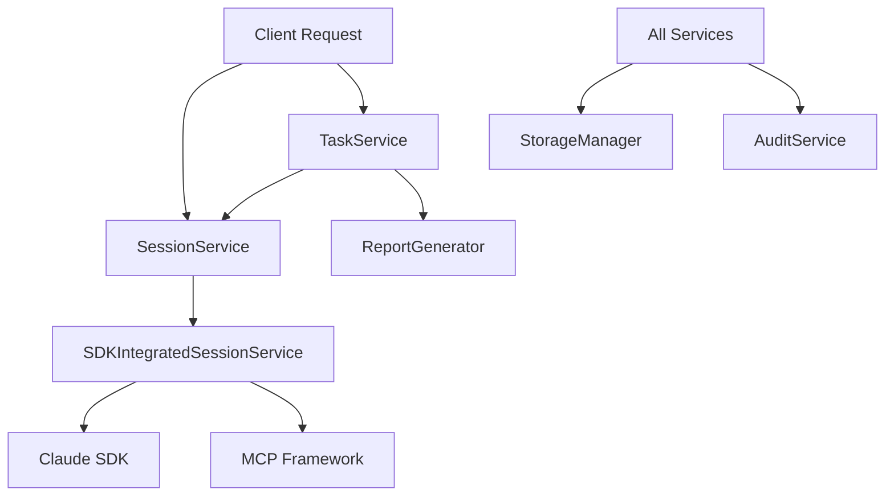

# Business Services

The service layer orchestrates business workflows, coordinates domain entities, and integrates with external systems. This layer implements the application's use cases and business processes.

## Service Architecture

### Service Composition

The service layer follows a **composition pattern** where specialized services handle specific business domains:



## Core Services

### SessionService

**File**: `app/services/session_service.py`

**Purpose**: Core session lifecycle management and CRUD operations

#### Responsibilities

- **Session Creation**: Initialize sessions with working directories and quota validation
- **Lifecycle Management**: Handle session state transitions and status updates
- **Authorization**: Verify user permissions for session access
- **Resource Management**: Coordinate with storage manager for file operations
- **Audit Integration**: Log all session operations for compliance

#### Key Methods

```python
async def create_session(
    user_id: UUID,
    mode: SessionMode, 
    sdk_options: dict,
    name: Optional[str] = None,
    parent_session_id: Optional[UUID] = None,
) -> Session

async def get_session(session_id: UUID, user_id: UUID) -> Session
async def list_sessions(user_id: UUID, skip: int = 0, limit: int = 100) -> list[Session]
async def transition_status(session_id: UUID, user_id: UUID, new_status: SessionStatus) -> Session
async def pause_session(session_id: UUID, user_id: UUID) -> Session
async def resume_session(session_id: UUID, user_id: UUID, fork: bool = False) -> Session
async def terminate_session(session_id: UUID, user_id: UUID, reason: Optional[str] = None) -> Session
```

#### Business Workflows

**Session Creation Workflow**:

1. Validate user quotas (concurrent sessions limit)
2. Create domain entity with proper initialization
3. Allocate working directory via StorageManager
4. Persist session to database
5. Log creation event via AuditService
6. Return session entity

**Session Forking Workflow**:

1. Retrieve parent session and validate access
2. Create new session with parent reference
3. Copy relevant configuration from parent
4. Initialize independent working directory
5. Mark as forked session (`is_fork = True`)

### SDKIntegratedSessionService

**File**: `app/services/sdk_session_service.py`

**Purpose**: Extends SessionService with Claude SDK integration and MCP framework support

#### Additional Responsibilities

- **Claude SDK Management**: Create and manage SDK client instances
- **MCP Configuration**: Dynamic configuration of Model Context Protocol servers
- **Message Streaming**: Process real-time message streams from Claude
- **Permission Callbacks**: Handle tool execution permission requests
- **Hooks Integration**: Implement audit, tracking, and cost monitoring hooks

#### Key Methods

```python
async def send_message(
    session_id: UUID,
    user_id: UUID, 
    message_text: str,
) -> AsyncIterator[Message]

async def _setup_sdk_client(self, session, user_id: UUID)
async def cleanup_session_client(self, session_id: UUID)
```

#### MCP Integration Workflow

**Dynamic MCP Configuration**:

1. **SDK Tools**: Include built-in tools (kubernetes_readonly, database, monitoring)
2. **User Servers**: Add user's personal MCP servers
3. **Global Servers**: Include organization-wide MCP servers  
4. **Merge Configuration**: Combine all servers into single MCP config
5. **Update Session**: Persist merged config to session.sdk_options
6. **SDK Client Creation**: Initialize Claude SDK with complete MCP setup

**Message Processing Flow**:

1. Validate session state and user permissions
2. Transition session to PROCESSING status
3. Setup SDK client if not exists (includes MCP config)
4. Create permission callbacks for tool access control
5. Setup hooks for audit logging and cost tracking
6. Send message through Claude SDK
7. Process streaming response with MessageProcessor
8. Persist messages and tool calls to database
9. Broadcast updates via WebSocket
10. Return session to ACTIVE status

### TaskService

**File**: `app/services/task_service.py`

**Purpose**: Task definition, execution, and scheduling management

#### Responsibilities

- **Task CRUD**: Create, read, update, delete task definitions
- **Template Rendering**: Jinja2-based prompt template processing
- **Task Execution**: Coordinate task execution via session creation
- **Report Generation**: Generate and store execution reports
- **Schedule Validation**: Validate cron expressions and scheduling logic

#### Key Methods

```python
async def create_task(
    user_id: UUID,
    name: str,
    prompt_template: str,
    allowed_tools: List[str],
    sdk_options: dict,
    **kwargs
) -> Task

async def execute_task(
    task_id: UUID,
    user_id: UUID,
    variables: dict = {},
    generate_report: bool = None,
    default_variables: dict = None,
) -> TaskExecutionResult
```

#### Task Execution Workflow

**Complete Execution Flow**:

1. **Retrieve Task**: Get task definition and validate ownership
2. **Render Template**: Process Jinja2 template with provided variables
3. **Create Session**: Initialize non-interactive session for execution
4. **Execute via SDK**: Send rendered prompt through Claude SDK
5. **Process Results**: Collect all messages and tool calls
6. **Generate Report**: Create report in specified format (JSON/Markdown/HTML/PDF)
7. **Store Report**: Persist report file via StorageManager  
8. **Cleanup Session**: Archive session working directory
9. **Return Results**: Provide execution summary and report location

**Template Rendering**:

```python
def _render_prompt_template(self, template: str, variables: dict) -> str:
    """
    Supports both Jinja2 syntax and simple {{variable}} substitution
    Provides safe rendering with error handling for missing variables
    """
```

### StorageManager

**File**: `app/services/storage_manager.py`

**Purpose**: File system operations and storage lifecycle management

#### Responsibilities

- **Working Directories**: Create and manage session-specific workspaces
- **Report Storage**: Store task execution reports in multiple formats
- **Archive Management**: Archive and cleanup old session data
- **Storage Quotas**: Track and enforce user storage limits
- **File Operations**: Provide safe file system access with proper isolation

#### Key Methods

```python
async def create_working_directory(self, session_id: UUID) -> Path
async def get_working_directory(self, session_id: UUID) -> Optional[Path]
async def archive_working_directory(self, session_id: UUID) -> Optional[Path]
async def save_report(self, report_id: UUID, content: str, format: str, metadata: dict) -> Path
async def get_total_storage_usage(self, user_id: Optional[UUID] = None) -> int
async def cleanup_old_archives(self, days: int = 180) -> int
```

#### Storage Organization

```
/data/
├── sessions/           # Active session working directories
│   └── {session_id}/   # Per-session isolated workspace
├── reports/            # Generated task execution reports  
│   └── {report_id}.{format}
└── archives/           # Archived session data
    └── {session_id}.tar.gz
```

### AuditService

**File**: `app/services/audit_service.py`

**Purpose**: Comprehensive audit logging and compliance tracking

#### Responsibilities

- **Security Events**: Log authentication, authorization, and access events
- **Business Events**: Track session lifecycle, task execution, and user actions
- **Compliance**: Maintain audit trails for regulatory requirements
- **Metrics**: Provide data for monitoring and analytics

#### Key Event Types

```python
async def log_session_created(self, session_id: UUID, user_id: UUID, ...)
async def log_session_terminated(self, session_id: UUID, user_id: UUID, reason: str)
async def log_task_executed(self, task_id: UUID, user_id: UUID, ...)
async def log_quota_exceeded(self, user_id: UUID, quota_type: str, ...)
async def log_permission_denied(self, user_id: UUID, resource: str, action: str)
```

## Service Integration Patterns

### Dependency Injection

Services use constructor injection for clean dependency management:

```python
class SDKIntegratedSessionService(SessionService):
    def __init__(
        self,
        # Parent dependencies
        db: AsyncSession,
        session_repo: SessionRepository,
        message_repo: MessageRepository,
        # Additional dependencies
        sdk_client_manager: ClaudeSDKClientManager,
        permission_service: PermissionService,
        event_broadcaster: EventBroadcaster,
    ):
        super().__init__(db, session_repo, message_repo, ...)
        self.sdk_client_manager = sdk_client_manager
```

### Transaction Management

Services manage database transactions with proper error handling:

```python
async def create_session(self, ...) -> Session:
    try:
        # Business logic operations
        session = Session(...)
        session_model = SessionModel(...)
        self.db.add(session_model)
        await self.db.flush()  # Get generated ID
        
        # Additional operations
        await self.audit_service.log_session_created(...)
        
        await self.db.commit()  # Commit transaction
        return session
    except Exception:
        await self.db.rollback()  # Rollback on error
        raise
```

### Error Handling Strategy

Services implement consistent error handling patterns:

- **Domain Exceptions**: Raise specific domain exceptions for business rule violations
- **External Failures**: Wrap external service errors with appropriate domain exceptions  
- **Transaction Safety**: Ensure database consistency with proper rollback handling
- **Audit Logging**: Log errors with full context for debugging and compliance

### Event Broadcasting

Services can broadcast events for real-time updates:

```python
# WebSocket event broadcasting
if self.event_broadcaster:
    await self.event_broadcaster.broadcast_session_event(
        session_id=session.id,
        event_type="message_received",
        data=message.to_dict(),
    )
```

## Service Coordination

### Inter-Service Communication

Services coordinate through well-defined interfaces:

- **TaskService** → **SessionService**: Creates sessions for task execution
- **SessionService** → **StorageManager**: Manages working directories  
- **All Services** → **AuditService**: Log business events
- **SDKIntegratedSessionService** → **PermissionService**: Handle tool permissions

### Async Operation Management

All services use async/await for non-blocking operations:

- **Database Operations**: Async SQLAlchemy for database access
- **External APIs**: Async HTTP clients for Claude API calls
- **File Operations**: Async file I/O for storage operations  
- **Redis Operations**: Async Redis client for caching and state

### Quota and Rate Limiting

Services implement quota enforcement at multiple levels:

- **User Level**: Concurrent sessions, API calls per hour, storage limits
- **Organization Level**: Total users, aggregate resource usage
- **System Level**: Global rate limiting and resource protection