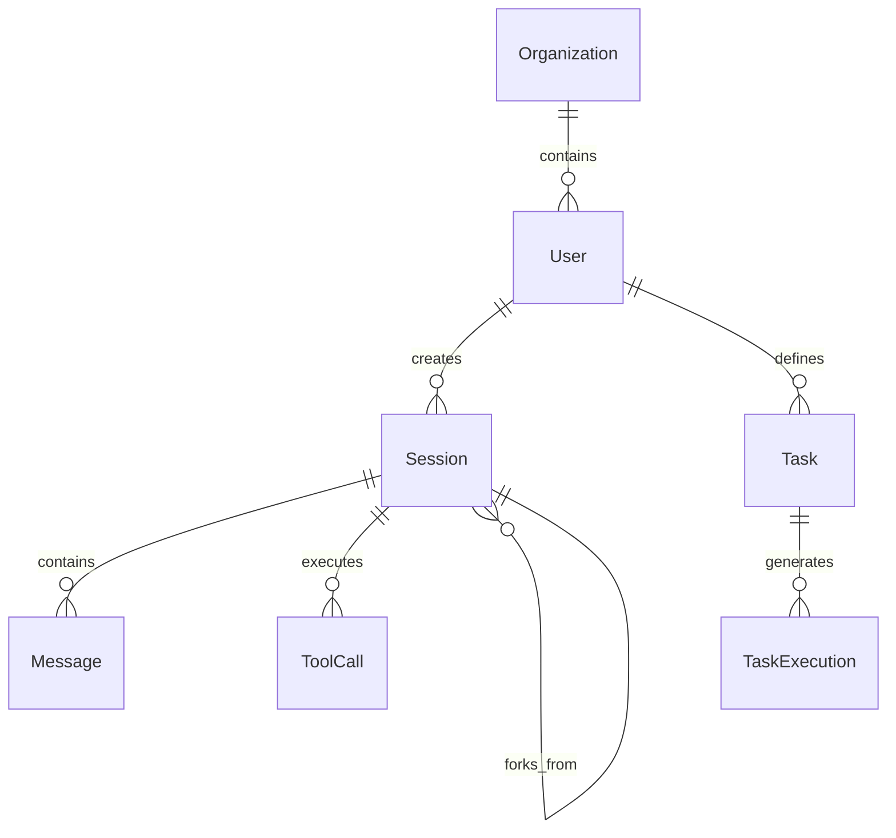

# Domain Entities

The domain layer contains the core business entities that encapsulate business rules and behavior. These entities are the heart of the Clean Architecture implementation.

## Entity Overview

### Core Entities

The service defines four primary domain entities, each serving as an aggregate root:

- **`User`** - User accounts with roles, quotas, and permissions
- **`Session`** - AI conversation sessions with lifecycle management  
- **`Task`** - Repeatable AI operations with scheduling and reporting
- **`Organization`** - Multi-tenant organizational boundaries

## User Entity

**File**: `app/domain/entities/user.py`

**Purpose**: Represents a user account with authentication, authorization, and resource quotas.

### User Roles

```python
class UserRole:
    ADMIN = "admin"     # Full system access
    USER = "user"       # Standard user operations  
    VIEWER = "viewer"   # Read-only access
```

### Key Attributes

- **Identity**: `id`, `organization_id`, `email`, `username`
- **Authentication**: `password_hash`, `is_active`, `last_login_at`
- **Authorization**: `role`, `is_superuser`
- **Quotas**: `max_concurrent_sessions`, `max_api_calls_per_hour`, `max_storage_mb`
- **Profile**: `full_name`, `avatar_url`

### Business Methods

```python
def update_last_login(self) -> None
def activate(self) / deactivate(self) -> None  
def set_role(self, role: str) -> None
def update_quotas(self, ...) -> None
def is_admin(self) -> bool
def can_access_session(self, session_user_id: UUID) -> bool
```

### Business Rules

- **Role Validation**: Only valid roles (admin/user/viewer) can be assigned
- **Admin Access**: Admins and superusers can access any session
- **Owner Access**: Users can only access their own sessions
- **Quota Enforcement**: User operations must respect configured limits

## Session Entity

**File**: `app/domain/entities/session.py`

**Purpose**: Represents an AI conversation session with state management and metrics tracking.

### Session Status Lifecycle

```python
class SessionStatus(str, Enum):
    CREATED = "created"           # Initial state
    CONNECTING = "connecting"     # Establishing SDK connection
    ACTIVE = "active"            # Ready for messages
    PAUSED = "paused"            # Temporarily suspended
    WAITING = "waiting"          # Awaiting user input
    PROCESSING = "processing"     # AI processing message
    COMPLETED = "completed"       # Session finished successfully
    FAILED = "failed"            # Session ended with error
    TERMINATED = "terminated"     # Forcibly ended
    ARCHIVED = "archived"        # Long-term storage
```

### Session Modes

```python
class SessionMode(str, Enum):
    INTERACTIVE = "interactive"        # Real-time user interaction
    NON_INTERACTIVE = "non_interactive" # Automated task execution
```

### Key Attributes

- **Identity**: `id`, `user_id`, `name`, `parent_session_id`
- **Configuration**: `mode`, `sdk_options`, `working_directory_path`
- **State**: `status`, `is_fork`
- **Metrics**: `total_messages`, `total_tool_calls`, `total_cost_usd`, `duration_ms`
- **API Usage**: Token counts (input/output/cache_creation/cache_read)
- **Results**: `result_data`, `error_message`

### State Transition Rules

```python
def can_transition_to(self, new_status: SessionStatus) -> bool
```

**Valid Transitions**:
- `CREATED` → `CONNECTING`, `TERMINATED`
- `CONNECTING` → `ACTIVE`, `FAILED`  
- `ACTIVE` → `WAITING`, `PROCESSING`, `PAUSED`, `COMPLETED`, `FAILED`, `TERMINATED`
- `PROCESSING` → `ACTIVE`, `COMPLETED`, `FAILED`
- Terminal states (`COMPLETED`, `FAILED`, `TERMINATED`) → `ARCHIVED`

### Business Methods

```python
def transition_to(self, new_status: SessionStatus) -> None
def increment_message_count(self) -> None
def increment_tool_call_count(self) -> None
def add_cost(self, cost_usd: float) -> None
def update_api_tokens(self, ...) -> None
def is_active(self) -> bool
def is_terminal(self) -> bool
def set_result(self, result_data: dict) -> None
def set_error(self, error_message: str) -> None
```

### Business Rules

- **State Validation**: Invalid state transitions raise `InvalidStateTransitionError`
- **Timing Tracking**: `started_at` set on first ACTIVE, `completed_at` on terminal states
- **Duration Calculation**: Automatic duration calculation when session completes
- **Immutable History**: Message and tool call counts only increment

## Task Entity

**File**: `app/domain/entities/task.py`

**Purpose**: Represents a reusable AI task definition with template rendering and scheduling capabilities.

### Key Attributes

- **Identity**: `id`, `user_id`, `name`, `description`
- **Definition**: `prompt_template`, `allowed_tools`, `disallowed_tools`, `sdk_options`
- **Execution**: `working_directory_path`
- **Scheduling**: `is_scheduled`, `schedule_cron`, `schedule_enabled`
- **Reporting**: `generate_report`, `report_format`, `notification_config`
- **Metadata**: `tags`, `is_public`, `is_active`, `is_deleted`

### Business Methods

```python
def render_prompt(self, variables: dict) -> str
def validate_schedule(self) -> None
def validate_report_format(self) -> None
def soft_delete(self) -> None
def activate(self) / deactivate(self) -> None
```

### Template Rendering

Uses **Jinja2** for prompt template rendering with variable substitution:

```python
# Template example
prompt_template = "Analyze the {{language}} code in {{file_path}} and identify {{issue_type}} issues."

# Rendered with variables
variables = {
    "language": "Python",
    "file_path": "/src/main.py", 
    "issue_type": "security"
}
rendered = task.render_prompt(variables)
# Result: "Analyze the Python code in /src/main.py and identify security issues."
```

### Business Rules

- **Schedule Validation**: Cron expressions validated using `croniter` library
- **Report Format Validation**: Must be one of: `json`, `markdown`, `html`, `pdf`
- **Soft Deletion**: Tasks are marked as deleted rather than physically removed
- **Activation State**: Tasks can be temporarily disabled without deletion

## Organization Entity

**File**: `app/domain/entities/organization.py`

**Purpose**: Multi-tenant organizational boundary for user and resource isolation.

### Key Attributes

- **Identity**: `id`, `name`, `slug`
- **Configuration**: `settings`, `feature_flags`
- **Limits**: `max_users`, `max_sessions_per_user`, `storage_limit_gb`
- **Billing**: `subscription_tier`, `billing_contact`

### Business Methods

```python
def add_user(self, user: User) -> None
def remove_user(self, user_id: UUID) -> None
def update_limits(self, ...) -> None
def is_feature_enabled(self, feature: str) -> bool
```

### Business Rules

- **Unique Slugs**: Organization slugs must be globally unique
- **User Limits**: Cannot exceed maximum user count per organization
- **Feature Flags**: Per-organization feature enablement
- **Resource Isolation**: Users can only access resources within their organization

## Entity Relationships

### Primary Relationships



### Key Constraints

- **User Organization Membership**: Users belong to exactly one organization
- **Session Ownership**: Sessions are owned by the creating user
- **Task Ownership**: Tasks are owned by the defining user
- **Session Forking**: Sessions can fork from parent sessions within same organization
- **Cross-tenant Isolation**: No cross-organization data access

## Domain Events

### Session Events

- `SessionCreated` - New session initialized
- `SessionStatusChanged` - State transition occurred
- `SessionCompleted` - Session finished successfully  
- `SessionFailed` - Session ended with error

### Task Events

- `TaskCreated` - New task definition saved
- `TaskScheduled` - Task added to execution schedule
- `TaskExecuted` - Task execution completed
- `TaskFailed` - Task execution failed

### User Events

- `UserRegistered` - New user account created
- `UserActivated` / `UserDeactivated` - Account status changed
- `QuotaExceeded` - User exceeded configured limits

## Validation Rules

### Cross-Entity Validation

- **Session Creation**: User must have available session quota
- **Task Execution**: User must have API call quota remaining  
- **File Operations**: Must not exceed user storage quota
- **Tool Access**: User must have permission for requested tools

### Data Integrity

- **Referential Integrity**: Foreign key relationships enforced
- **Business Constraints**: Domain rules validated before persistence
- **Audit Requirements**: All entity changes logged with user context
- **Soft Deletion**: Entities marked as deleted rather than removed