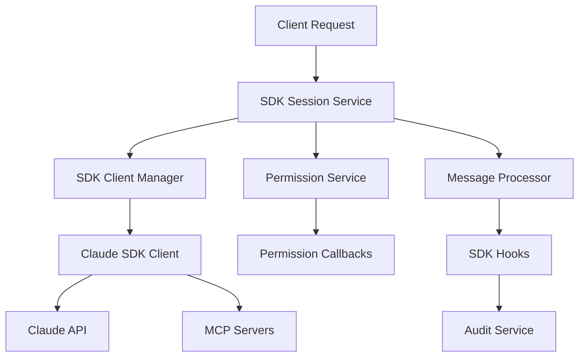
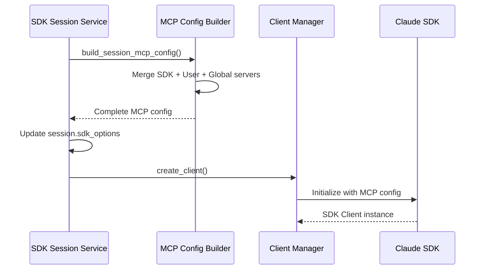
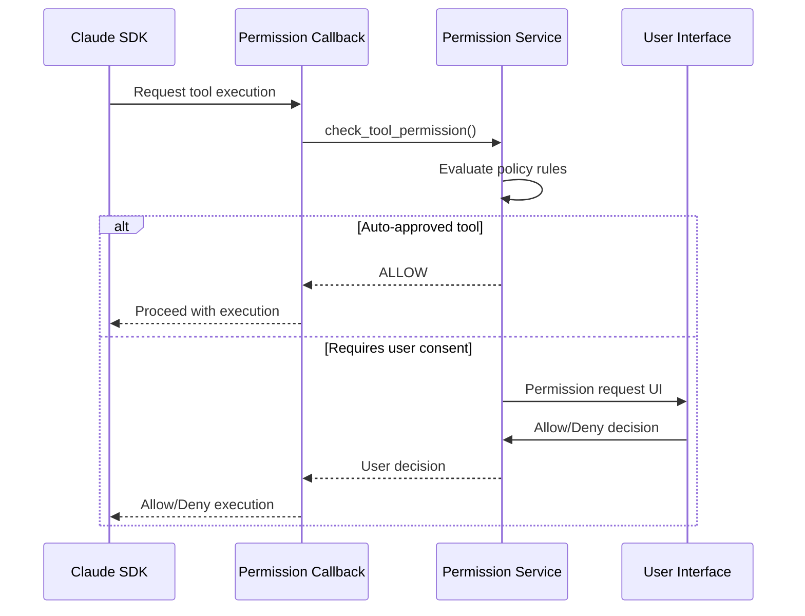
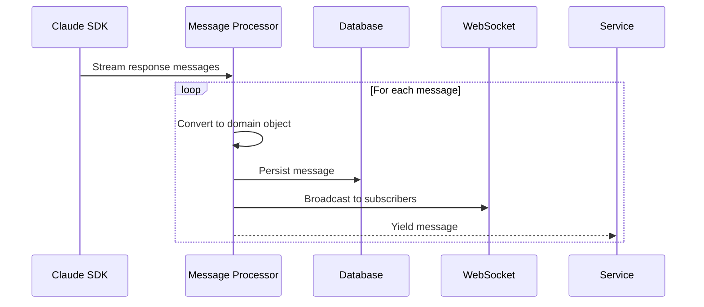

# Claude SDK Integration

The service provides deep integration with Anthropic's official Claude Agent SDK, enhanced with the Model Context Protocol (MCP) framework for extensible tool integration.

## SDK Architecture

### Claude SDK Components

The integration consists of several specialized components that work together to provide a complete Claude SDK experience:



### Core Integration Files

- **`app/claude_sdk/client_manager.py`** - SDK client lifecycle management
- **`app/claude_sdk/permission_service.py`** - Tool access control system  
- **`app/claude_sdk/message_processor.py`** - Response stream processing
- **`app/claude_sdk/event_broadcaster.py`** - WebSocket event distribution
- **`app/claude_sdk/hooks.py`** - SDK lifecycle hooks for audit and tracking

## MCP Framework Integration

### Model Context Protocol Overview

**MCP (Model Context Protocol)** enables Claude to interact with external tools and data sources through a standardized interface. The service provides:

- **Built-in MCP Servers**: Kubernetes, database, and monitoring tools
- **External MCP Servers**: User-configured external tool servers  
- **Dynamic Configuration**: Runtime MCP server management
- **Permission System**: Granular control over tool access

### MCP Configuration Builder

**File**: `app/mcp/config_builder.py`

**Purpose**: Dynamically build MCP configurations by merging multiple server sources

#### Configuration Sources

1. **SDK MCP Servers**: Built-in tools provided by the service
   - `kubernetes_readonly`: Read-only Kubernetes cluster access
   - `database`: Database query and inspection tools  
   - `monitoring`: Metrics and health check tools

2. **User MCP Servers**: Personal external MCP servers per user
   - Custom tools and integrations
   - User-specific configurations
   - Private server access

3. **Global MCP Servers**: Organization-wide shared servers
   - Common organizational tools
   - Shared database connections
   - Enterprise integrations

#### Dynamic Configuration Process

```python
async def build_session_mcp_config(
    self,
    user_id: UUID,
    include_sdk_tools: bool = True,
) -> Dict[str, MCPServerConfig]:
    """
    Build complete MCP configuration for session by merging:
    1. SDK built-in servers (if include_sdk_tools=True)
    2. User's personal MCP servers 
    3. Organization's global MCP servers
    """
```

**Configuration Merging Logic**:

1. Start with SDK servers if enabled
2. Add user's personal servers (override SDK if name conflicts)  
3. Add organization servers (user servers take precedence)
4. Validate server configurations
5. Return merged configuration dictionary

### SDK Client Lifecycle

#### Client Creation Flow



#### Client Management

**`ClaudeSDKClientManager`** handles SDK client lifecycle:

```python
class ClaudeSDKClientManager:
    async def create_client(
        self,
        session: Session,
        permission_callback: PermissionCallback,
        hooks: Dict[str, List[HookMatcher]],
    ) -> None
    
    async def get_client(self, session_id: UUID) -> ClaudeSDKClient
    async def disconnect_client(self, session_id: UUID) -> None
    def has_client(self, session_id: UUID) -> bool
```

**Client Features**:
- **Session Isolation**: Each session has dedicated SDK client instance
- **Automatic Cleanup**: Clients automatically disconnected on session termination
- **Resource Management**: Connection pooling and resource cleanup
- **Error Recovery**: Automatic reconnection on transient failures

## Permission System

### Tool Access Control

The permission system provides granular control over which tools Claude can execute during a session.

#### Permission Callback Architecture

```python
class PermissionService:
    def create_permission_callback(
        self,
        session_id: UUID,
        user_id: UUID,
    ) -> PermissionCallback:
        """Create permission callback for tool execution requests"""
```

#### Permission Decision Flow



#### Permission Policies

**Tool Classification**:

- **Auto-Approved**: Safe read-only operations (file reading, status checks)
- **User Consent Required**: Potentially destructive operations (file writing, API calls)
- **Forbidden**: Never allowed operations (system modification, credential access)

**Policy Configuration**:

```python
# Example permission policy
policy = {
    "auto_approved": [
        "file_read",
        "directory_list", 
        "git_status",
        "kubernetes_get_pods",
    ],
    "user_consent": [
        "file_write",
        "api_call",
        "kubernetes_apply",
    ],
    "forbidden": [
        "system_command",
        "credential_access",
    ]
}
```

## SDK Hooks System

### Hook Architecture

The SDK provides lifecycle hooks for extending functionality without modifying core logic:

```python
from claude_agent_sdk.types import HookMatcher

hooks = {
    "PreToolUse": [
        HookMatcher(hooks=[
            create_audit_hook(session_id, audit_service),
            create_tool_tracking_hook(session_id, db, tool_call_repo),
        ]),
    ],
    "PostToolUse": [
        HookMatcher(hooks=[
            create_cost_tracking_hook(session_id, db, session_repo),
        ]),
    ],
}
```

### Available Hooks

#### Audit Hook

**Purpose**: Log all tool executions for compliance and debugging

```python
def create_audit_hook(session_id: UUID, audit_service: AuditService):
    """
    Logs:
    - Tool execution attempts
    - Permission decisions  
    - Execution results
    - Error conditions
    """
```

#### Tool Tracking Hook

**Purpose**: Persist tool call information to database

```python  
def create_tool_tracking_hook(
    session_id: UUID,
    db: AsyncSession,
    tool_call_repo: ToolCallRepository,
):
    """
    Tracks:
    - Tool call metadata (name, input, timing)
    - Execution status and results
    - Error messages and stack traces
    - Performance metrics
    """
```

#### Cost Tracking Hook

**Purpose**: Calculate and track API usage costs

```python
def create_cost_tracking_hook(
    session_id: UUID, 
    db: AsyncSession,
    session_repo: SessionRepository,
):
    """
    Updates:
    - Token usage counters
    - Cost calculations
    - Session metrics
    - Usage quotas
    """
```

## Message Processing

### Stream Processing Architecture

The `MessageProcessor` handles real-time processing of Claude SDK response streams:

```python
class MessageProcessor:
    async def process_message_stream(
        self,
        session: Session,
        sdk_messages: AsyncIterator[SDKMessage], 
    ) -> AsyncIterator[Message]:
        """
        Process SDK message stream and yield domain Message objects
        Handles: text messages, tool calls, errors, system events
        """
```

### Message Flow



### Message Types

**Supported Message Types**:

- **Text Messages**: Human and assistant text content
- **Tool Calls**: Tool execution requests and responses
- **System Messages**: Status updates and control messages  
- **Error Messages**: Error conditions and recovery information

## Event Broadcasting

### Real-time Updates

The `EventBroadcaster` provides WebSocket-based real-time updates:

```python
class EventBroadcaster:
    async def broadcast_session_event(
        self,
        session_id: UUID,
        event_type: str,
        data: dict,
    ) -> None:
        """Broadcast event to all session subscribers"""
```

### Event Types

- **`message_received`**: New message in session
- **`tool_call_started`**: Tool execution began
- **`tool_call_completed`**: Tool execution finished
- **`session_status_changed`**: Session state transition
- **`error_occurred`**: Error condition detected

### WebSocket Integration

**Connection Management**:

```python
# WebSocket endpoint with authentication
@app.websocket("/ws/sessions/{session_id}")
async def websocket_endpoint(
    websocket: WebSocket,
    session_id: UUID,
    token: str = Query(...),
):
    # Authenticate user from token
    user = authenticate_websocket_token(token)
    
    # Authorize session access
    validate_session_access(session_id, user.id)
    
    # Subscribe to session events
    await event_broadcaster.subscribe(session_id, websocket)
```

## Error Handling

### SDK Error Recovery

**Connection Failures**: Automatic reconnection with exponential backoff
**API Rate Limits**: Respect Claude API rate limiting headers  
**Tool Execution Errors**: Graceful handling with error reporting
**Permission Denials**: Clear error messages with resolution guidance

### Error Propagation

```python
try:
    async for message in sdk_client.query(prompt):
        yield message
except ClaudeAPIError as e:
    session.set_error(f"Claude API error: {e}")
    raise SessionExecutionError(f"SDK error: {e}") from e
except MCPServerError as e:
    session.set_error(f"MCP server error: {e}")
    raise ToolExecutionError(f"MCP error: {e}") from e
```

## Performance Optimization

### Resource Management

- **Client Pooling**: Reuse SDK clients across requests
- **Connection Limits**: Configurable concurrent connection limits
- **Memory Management**: Automatic cleanup of completed sessions
- **Token Optimization**: Efficient token usage with caching

### Monitoring Integration

- **Metrics Collection**: SDK operation metrics via Prometheus
- **Performance Tracking**: Response time and throughput monitoring  
- **Error Rates**: SDK error frequency and categorization
- **Resource Usage**: Memory and connection utilization tracking