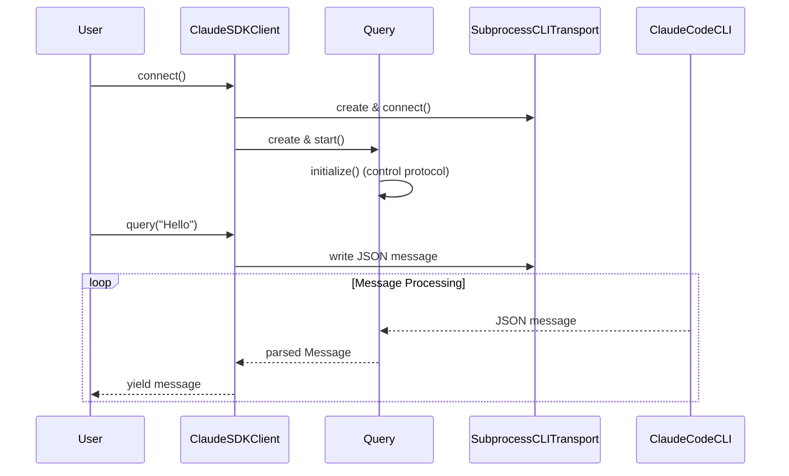
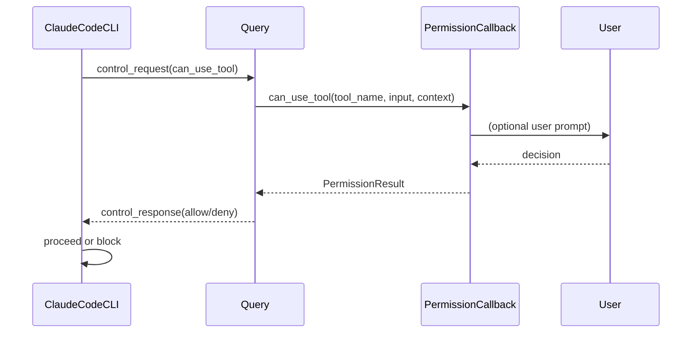
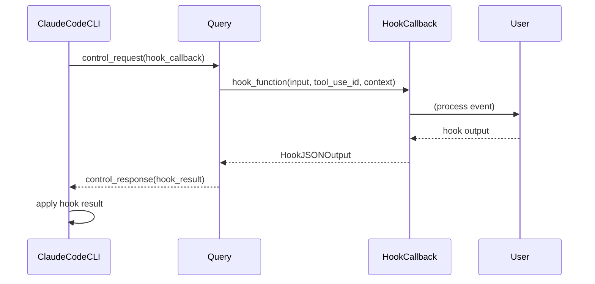
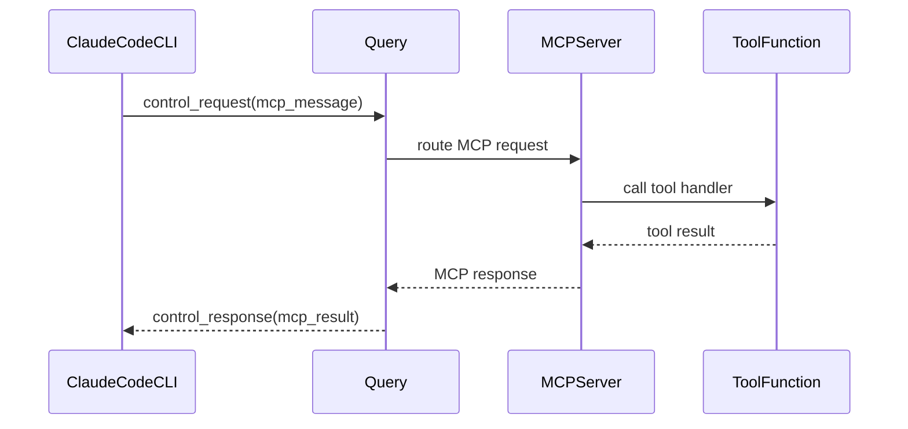

# Claude Agent SDK - Technical Overview

## Introduction

The Claude Agent SDK is a Python library that provides a sophisticated interface to interact with Claude Code (the CLI version of Claude that can execute code, manipulate files, and work with external tools). Rather than communicating directly with Claude's API, the SDK acts as a bridge to the Claude Code CLI, enabling rich interactive capabilities through a bidirectional communication protocol.

## Core Architecture

### High-Level Components

```
┌─────────────────────────────────────────────────────────────┐
│                    Public API Layer                        │
├─────────────────────────────────────────────────────────────┤
│  query()           ClaudeSDKClient        MCP Tools        │
│  (simple)          (streaming)            (@tool decorator) │
└─────────────────────────────────────────────────────────────┘
                              │
┌─────────────────────────────────────────────────────────────┐
│                 Internal Implementation                     │
├─────────────────────────────────────────────────────────────┤
│  InternalClient    Query               Message Parser       │
│  (coordination)    (control protocol)  (type conversion)    │
└─────────────────────────────────────────────────────────────┘
                              │
┌─────────────────────────────────────────────────────────────┐
│                    Transport Layer                         │
├─────────────────────────────────────────────────────────────┤
│  Transport         SubprocessCLITransport                  │
│  (abstract)        (Claude Code CLI)                       │
└─────────────────────────────────────────────────────────────┘
                              │
┌─────────────────────────────────────────────────────────────┐
│                   Claude Code CLI                          │
├─────────────────────────────────────────────────────────────┤
│  Process spawned with JSON I/O over stdin/stdout           │
└─────────────────────────────────────────────────────────────┘
```

## Component Deep Dive

### 1. Public API Layer

#### 1.1 query() Function
- **Purpose**: Simple, fire-and-forget interactions
- **Communication**: Unidirectional (send all inputs, receive all outputs)
- **Use Cases**: Batch processing, one-shot questions, automation scripts
- **Implementation**: Internally uses `InternalClient` with string prompts

#### 1.2 ClaudeSDKClient Class
- **Purpose**: Full-featured bidirectional client
- **Communication**: Streaming, interactive conversations
- **Use Cases**: Chat interfaces, debugging sessions, multi-turn conversations
- **Implementation**: Always uses streaming mode with control protocol

#### 1.3 MCP (Model Context Protocol) Support
- **SDK MCP Servers**: In-process tools using `@tool` decorator
- **External MCP Servers**: Subprocess-based tools (stdio, SSE, HTTP)
- **Hybrid Support**: Mix both types in a single session

### 2. Internal Implementation Layer

#### 2.1 InternalClient
**Role**: Coordinates the overall query processing flow

**Key Responsibilities**:
- Validates configuration options
- Creates and configures transport
- Manages SDK MCP server extraction
- Orchestrates Query lifecycle

**Critical Logic**:
```python
# Permission validation
if options.can_use_tool and isinstance(prompt, str):
    raise ValueError("can_use_tool requires streaming mode")

# Auto-configure control protocol
if options.can_use_tool:
    options = replace(options, permission_prompt_tool_name="stdio")
```

#### 2.2 Query Class
**Role**: Implements the bidirectional control protocol

**Key Features**:
- **Control Request/Response**: Bidirectional communication with Claude Code CLI
- **Hook Management**: Event interception and callback routing
- **Permission Handling**: Tool usage authorization
- **SDK MCP Routing**: In-process tool execution

**Control Protocol Flow**:
```
SDK → Control Request → Claude Code CLI
├─ can_use_tool (permission check)
├─ hook_callback (event interception)
├─ mcp_message (SDK tool calls)
├─ set_permission_mode (runtime config)
└─ interrupt (stop execution)

Claude Code CLI → Control Response → SDK
├─ success (with response data)
└─ error (with error message)
```

#### 2.3 Message Parser
**Role**: Converts raw JSON from CLI into typed Python objects

**Message Types**:
- `UserMessage`: User inputs with content blocks
- `AssistantMessage`: Claude responses with content blocks
- `SystemMessage`: System notifications and metadata
- `ResultMessage`: Final results with cost/usage information
- `StreamEvent`: Partial updates during streaming (when enabled)

**Content Block Types**:
- `TextBlock`: Plain text content
- `ThinkingBlock`: Claude's reasoning process (with cryptographic signature)
- `ToolUseBlock`: Tool invocation requests
- `ToolResultBlock`: Tool execution results

### 3. Transport Layer

#### 3.1 Transport Abstract Base Class
**Purpose**: Defines the interface for communication channels

**Key Methods**:
- `connect()`: Establish connection
- `write(data)`: Send raw data
- `read_messages()`: Receive and parse JSON messages
- `end_input()`: Close input stream
- `close()`: Cleanup resources

#### 3.2 SubprocessCLITransport
**Purpose**: Implements transport using Claude Code CLI as subprocess

**Process Lifecycle**:
1. **Command Building**: Constructs CLI arguments from options
2. **Process Spawning**: Starts subprocess with appropriate pipes
3. **Stream Management**: Handles stdin/stdout/stderr streams
4. **Version Checking**: Validates minimum Claude Code version
5. **Error Handling**: Monitors process health and exit codes

**Communication Protocol**:
```
Python SDK ←→ stdin/stdout ←→ Claude Code CLI ←→ Claude API
           JSON streams          Network requests
```

## Request Processing Flows

### 1. Simple Query Flow (query() function)

```mermaid
sequenceDiagram
    participant User
    participant query()
    participant InternalClient
    participant SubprocessCLITransport
    participant ClaudeCodeCLI

    User->>query(): query(prompt="Hello")
    query()->>InternalClient: process_query()
    InternalClient->>SubprocessCLITransport: create & connect()
    SubprocessCLITransport->>ClaudeCodeCLI: spawn process with args
    ClaudeCodeCLI-->>SubprocessCLITransport: JSON messages
    SubprocessCLITransport-->>InternalClient: parsed messages
    InternalClient-->>query(): Message objects
    query()-->>User: yield messages
```

### 2. Streaming Client Flow (ClaudeSDKClient)



### 3. Tool Permission Flow



### 4. Hook Execution Flow



### 5. SDK MCP Tool Flow



## Configuration and Options

### ClaudeAgentOptions Structure

The `ClaudeAgentOptions` class serves as the central configuration hub:

```python
@dataclass
class ClaudeAgentOptions:
    # Tool Management
    allowed_tools: list[str] = field(default_factory=list)
    disallowed_tools: list[str] = field(default_factory=list)
    
    # Permission System
    permission_mode: PermissionMode | None = None
    can_use_tool: CanUseTool | None = None
    permission_prompt_tool_name: str | None = None
    
    # Model and Prompting
    model: str | None = None
    system_prompt: str | SystemPromptPreset | None = None
    
    # Session Management
    continue_conversation: bool = False
    resume: str | None = None
    max_turns: int | None = None
    
    # MCP Configuration
    mcp_servers: dict[str, McpServerConfig] | str | Path = field(default_factory=dict)
    
    # Environment
    cwd: str | Path | None = None
    cli_path: str | Path | None = None
    env: dict[str, str] = field(default_factory=dict)
    
    # Hook System
    hooks: dict[HookEvent, list[HookMatcher]] | None = None
    
    # Advanced Options
    include_partial_messages: bool = False
    fork_session: bool = False
    agents: dict[str, AgentDefinition] | None = None
    setting_sources: list[SettingSource] | None = None
```

## Error Handling and Recovery

### Error Hierarchy

```
ClaudeSDKError (base)
├── CLIConnectionError (connection issues)
│   ├── CLINotFoundError (CLI not installed)
│   └── ProcessError (process failures)
├── CLIJSONDecodeError (parsing errors)
└── MessageParseError (message format errors)
```

### Recovery Strategies

1. **Connection Errors**: Automatic CLI discovery, clear installation instructions
2. **Process Errors**: Exit code analysis, stderr capture
3. **JSON Errors**: Buffer management, partial message handling
4. **Permission Errors**: Fallback to prompting, clear error messages

## Performance Considerations

### Buffer Management
- **Default buffer size**: 1MB for JSON messages
- **Configurable**: Via `max_buffer_size` option
- **Streaming**: Prevents memory buildup in long conversations

### Async Architecture
- **anyio-based**: Cross-platform async I/O
- **Task groups**: Proper cancellation and resource cleanup
- **Concurrent operations**: Message reading, stderr monitoring, input streaming

### Process Lifecycle
- **Health monitoring**: Process exit detection
- **Resource cleanup**: Proper stream closure and process termination
- **Error propagation**: Failed processes raise appropriate exceptions

## Security Model

### Permission System
1. **Default Mode**: CLI prompts for dangerous operations
2. **Accept Edits**: Auto-approve file modifications
3. **Bypass Permissions**: Allow all operations (use with caution)
4. **Custom Callbacks**: User-defined permission logic

### Hook Security
- **Event Interception**: Modify or block operations
- **Input Validation**: Sanitize tool inputs
- **Output Filtering**: Control information exposure

### Process Isolation
- **Subprocess boundaries**: SDK and Claude Code run in separate processes
- **Environment control**: Configurable environment variables
- **Working directory**: Isolation of file operations

## Extensibility Points

### Custom Transports
Implement the `Transport` interface for alternative communication channels:
- Remote Claude Code instances
- Network-based protocols
- Custom authentication mechanisms

### MCP Server Integration
- **SDK Servers**: In-process Python tools
- **External Servers**: Subprocess, HTTP, SSE protocols
- **Hybrid Configurations**: Mix both approaches

### Hook System
- **Event-driven**: React to specific operations
- **Modification**: Change inputs/outputs
- **Cancellation**: Block operations based on custom logic

This technical overview provides the foundation for understanding how the Claude Agent SDK orchestrates complex interactions between Python applications and Claude Code, enabling sophisticated AI-powered workflows with full control over permissions, tools, and conversation flow.